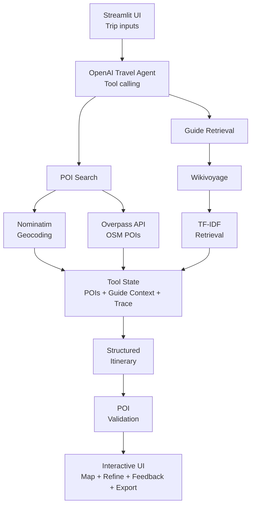

# ✈️ TripAgent 

An agentic AI travel planner that researches real-world points of interest,
retrieves destination context, and generates structured multi-day itineraries.

Built with Python, Streamlit, OpenAI, OpenStreetMap, Wikivoyage, and PyDeck.

## Overview

TripAgent uses an AI agent rather than relying on a single LLM prompt.

The agent can:

- search for real points of interest
- retrieve destination context
- generate structured itineraries
- validate every displayed POI
- refine existing itineraries
- visualize trips on an interactive map

## Key Features

- Agentic itinerary generation with tool calling
- Real POI search through OpenStreetMap
- Nominatim geocoding
- Overpass API integration
- Wikivoyage retrieval-augmented generation
- TF-IDF guide retrieval
- Structured itinerary generation
- POI validation to reduce hallucinated locations
- Interactive PyDeck maps
- Day filters
- Color-coded itinerary days
- Numbered itinerary stops
- Itinerary refinement
- Single-day refinement
- Feedback-based POI ranking
- Fast Mode
- Agent execution traces and timings
- Retry and timeout handling
- JSON itinerary export

## Architecture

## 🧠 Architecture



## Example Use Case

A user might request:

> Plan a 3-day trip to Tokyo with a balanced pace. I like food,
> history, museums, and local culture. Avoid very early mornings.

TripAgent researches relevant real-world POIs, retrieves useful travel-guide
context, creates a structured itinerary, validates its POI IDs, and displays
the resulting trip on an interactive map.

## Example Output

```text
Tokyo

Day 1

Morning
Shinjuku Gyoen National Garden

Afternoon
Tokyo Metropolitan Government Building

Evening
Shinjuku dining area
```

## Setup

Clone the repository:

```bash
git clone YOUR_GITHUB_URL
cd trip-agent
```

Create a virtual environment:

```bash
python -m venv trip-planner-env
```

Activate it on Windows:

```powershell
.\trip-planner-env\Scripts\Activate.ps1
```

Install dependencies:

```bash
python -m pip install -r requirements.txt
```

Run TripAgent:

```bash
python -m streamlit run app.py
```

## API Requirements

### OpenAI

An OpenAI API key is required for itinerary generation and refinement.

The key is entered by the user through the Streamlit sidebar and is not
hardcoded into the application.

API cost depends on the selected model and token usage.

### Nominatim

Nominatim is used to geocode destination names.

The public Nominatim service has strict usage requirements and should not be
used for heavy traffic.

### Overpass API

Overpass retrieves OpenStreetMap POIs.

Public Overpass instances are shared infrastructure and can occasionally
return rate limits or timeouts.

TripAgent uses caching, retries, query limits, and error handling to reduce
unnecessary traffic.

### Wikivoyage

Wikivoyage provides optional destination context for the RAG system.

Travel-guide text is chunked and ranked using TF-IDF similarity.

## Known Limitations

- Public Overpass servers can occasionally return timeouts.
- Map connecting lines represent itinerary order, not actual street routing.
- Some OpenStreetMap places may not have English names.
- Travel times are not currently calculated.
- Hotels and flights are not integrated.
- Weather is not currently integrated.
- Public deployment does not yet include user accounts or persistent cloud storage.

## Future Improvements

- User authentication
- Cloud database-backed saved trips
- Weather forecasts
- Budget tracking
- Walking and transit routing
- PDF itinerary export
- Shareable trip URLs
- Multiple itinerary comparison
- Destination preview images

## Tech Stack

- Python
- Streamlit
- OpenAI Responses API
- OpenStreetMap
- Nominatim
- Overpass API
- Wikivoyage
- scikit-learn
- PyDeck